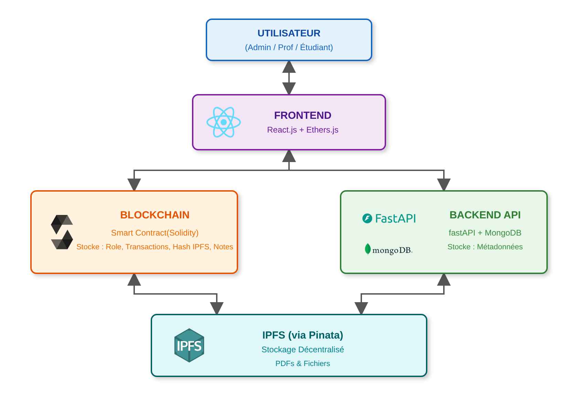
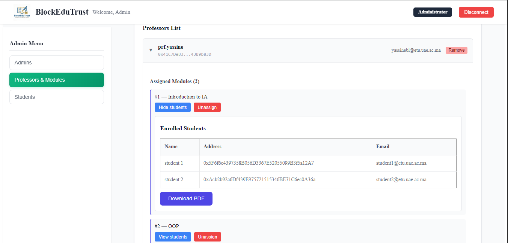

# 🎓 BlockEduTrust

### Blockchain-Based Academic Management System

BlockEduTrust is a decentralized academic management platform that leverages **Blockchain**, **Smart Contracts**, **IPFS**, and a **modern web stack** to ensure transparency, security, and trust in academic processes.

---

## 🚀 Project Overview

BlockEduTrust aims to modernize academic management systems by using blockchain technology to:

- Securely manage roles (Admin, Professor, Student)
- Ensure integrity of assignments, submissions, and grades
- Provide transparent and tamper-proof academic records
- Protect sensitive data using cryptography and decentralized storage

The system combines **on-chain logic** (Smart Contracts) with **off-chain services** (Backend & IPFS) to balance security, scalability, and usability.

---

## 🧩 System Architecture

The platform is built on four main layers:

### 1️⃣ Frontend — `academic-dapp/`

- Built with **React.js**
- Role-based dashboards (Admin / Professor / Student)
- MetaMask authentication
- File upload, encryption, and decryption
- Professional UI with role-based theming

### 2️⃣ Blockchain — Smart Contract (Solidity)

- Role management and access control
- Module, assignment, submission, and grading logic
- Immutable storage of critical academic actions

### 3️⃣ Backend — `Fast-api-Backend/`

- Built with **FastAPI**
- MongoDB database
- Stores metadata only (names, emails, titles, descriptions)
- REST API consumed by the frontend

### 4️⃣ Decentralized Storage — IPFS (Pinata)

- Stores PDFs, assignments, and submissions
- Only IPFS CIDs are stored on-chain

---

## 👥 User Roles

### 👑 Admin

- Manage users (Admins, Professors, Students)
- Create and manage modules
- Assign professors to modules
- View enrolled students per module
- Export student lists as PDF

### 👨‍🏫 Professor

- Access assigned modules
- Upload course materials
- Create assignments with cryptographic key pairs
- View and decrypt student submissions
- Grade assignments and update grades

### 👨‍🎓 Student

- View enrolled modules
- Access course materials
- Submit assignments (encrypted)
- View grades and professor feedback

---

## 🔐 Security Features

- MetaMask-based authentication
- Role-based access enforced by smart contracts
- RSA public/private key encryption for submissions
- Immutable blockchain records
- Decentralized file storage via IPFS

---

## 🛠️ Technology Stack

### Frontend

- React.js
- ethers.js
- Web Crypto API
- jsPDF
- CSS / Tailwind CSS

### Backend

- FastAPI
- MongoDB
- Pydantic

### Blockchain

- Solidity
- Ethereum (Testnet – Sepolia)
- MetaMask

### Storage

- IPFS (Pinata)
  

---

## ⚙️ Installation & Setup

### Prerequisites

- Node.js
- MetaMask browser extension
- Python 3.9+
- MongoDB
- Pinata account

### Frontend

```bash
cd academic-dapp
npm install
npm start
```

## 



### Backend

```bash
cd Fast-api-Backend
python main.py
```


### Smart Contract

- Compile and deploy using Remix or Hardhat
- Update the contract address and ABI in the frontend

---

## 📊 Project Highlights

- Hybrid on-chain / off-chain architecture
- Secure academic workflow
- Professional, role-based UI
- Designed for academic transparency and integrity

---
